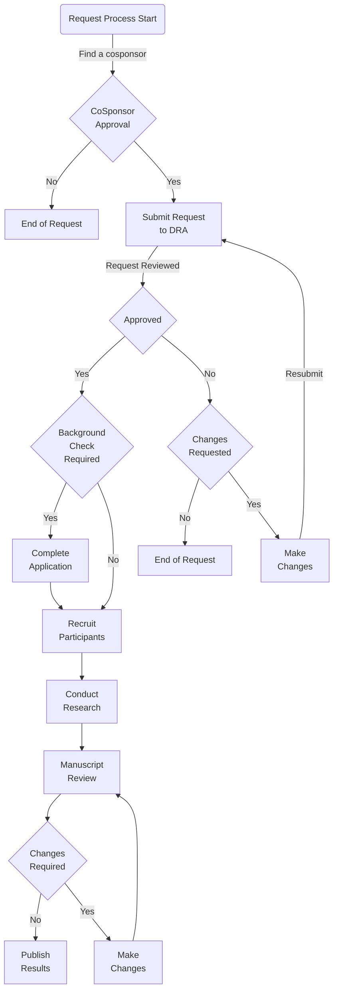
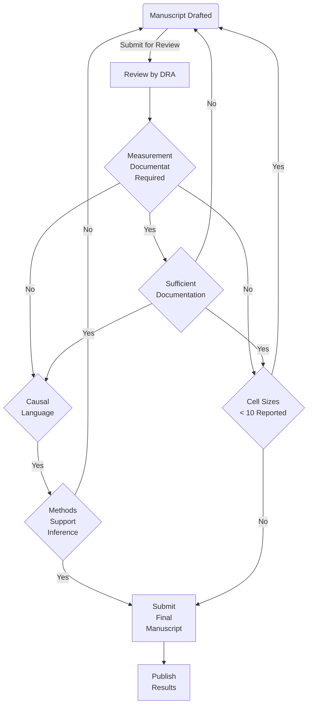

# Research and Data Requests at Fayette County Public Schools
In an effort to increase transparency, improve efficiency, and enhance the quality and value of research conducted in and with our schools, the [Office of Data, Research, and Accountability](https://www.fcps.net/Domain/2284) has prepared the following guidance to assist prospective researchers seeking to work with our district.   Please review the requirements below prior to submitting a research request.

Thank you,
[Office of Data, Research, and Accountability](https://www.fcps.net/Domain/2284)

* [Overview of research activities in FCPS](#overview-of-research-activities-in-fcps)
* [Research/Evaluation Not Requiring Approval](#researchevaluation-not-requiring-approval)
* [Timelines for Conducting Research/Evaluation in FCPS](#timelines-for-conducting-researchevaluation-in-fcps)
* [District Co-Sponsorship](#district-co-sponsorship)
	* [What does the co-sponsor do for you?](#what-does-the-co-sponsor-do-for-you)
	* [How do you find a co-sponsor?](#how-do-you-find-a-co-sponsor)
	* [What to do when you find a co-sponsor?](#what-to-do-when-you-find-a-co-sponsor)
* [Research/Evaluation Proposal Requirements](#researchevaluation-proposal-requirements)
* [Information on Video  Recording](#information-on-video--recording)
* [Information on Studies Involving Sensitive Topics](#information-on-studies-involving-sensitive-topics)
* [Privacy of Student and Stakeholder Data](#privacy-of-student-and-stakeholder-data)
* [Manuscript Review](#manuscript-review)
* [Contact Information](#contact-information)

# Overview of research activities in FCPS 
The following workflow diagram provides a high level overview of the process. Some required components (e.g., collection of informed consent) are  excluded in this workflow diagram for brevity.

	<ol>
		<li> All research conducted in Fayette County Public Schools  (FCPS)  must be reviewed and approved prior to the commencement of any research activities. </li> 
		<li> Prior to submitting a research proposal for approval and review, the applicant must secure a [district co-sponsor](#cosponsor).</li> 
		<li> Requests for review and approval of research must be submitted electronically  to the [Office of Data, Research, and Accountability](https://www.fcps.net/Domain/2284) using our [online request system](https://webapps.fcps.net/Research/). </li> 
		<li> Once approved by the district, the researcher  is responsible to secure approval and informed consent from any school leaders, teachers, parents, and/or students as necessary for  his/her  research.</li> 
		<li> Prior to the submission of any materials for publication, the researcher must submit the manuscript to the [Office of Data, Research, and Accountability](https://www.fcps.net/Domain/2284) for final review/approval.</li> 
	</ol> 
 
A partial list of guidelines to keep in mind when considering whether or not your research request is likely to receive approval is presented below:

* The study __must__ address how the results can be used to improve the lives of the children and families served by  FCPS.
* Any research using educational or psychological measurement tools not currently used by FCPS __must__ provide the appropriate documentation defined in the [Standards for Educational and Psychological Testing](https://www.ncme.org/ncme/NCME/NCME/Publication/Testing_Standards.aspx); requests that do not comply with this guideline will be rejected.
* Any research proposing the use of researcher developed measurement tools __must__ include how the appropriate documentation defined in the [Standards for Educational and Psychological Testing](https://www.ncme.org/ncme/NCME/NCME/Publication/Testing_Standards.aspx) will be developed and disseminated; requests that do not comply with this guideline will be rejected.
* The study __must__ be in alignment with [district priorities](https://www.fcps.net/cms/lib/KY01807169/Centricity/Domain/3899/Strategic%20Plan/strategic_plan.pdf).
* The study __must__ have the potential to make a definite contribution to the education profession and/or to the FCPS in particular.
* The study __must__ be pedagogically sound - if appropriate - and feasible in terms of its demands on the time and resources of FCPS students, families, and staff.
* The study design __must__ minimize disruption to instructional time.
* Staff  members’ participation  in external research projects __must not__ interfere with their ability and availability to complete their assigned duties.
* There __must__ be reasonable assurance that no FCPS stakeholders will suffer or be caused any harm as a result of the research.
* The researcher __must__ use appropriate methods to secure __informed consent from study participants__.
* The study __must__ be capable of yielding results that are valid for the research questions and/or hypotheses under study.
* The project __must__ comply with all ethical standards for research and all regulations, policies, and laws set forth in federal and state law.
* If the project uses any _causal_ language,  the proposed methodology __must__ provide a valid causal estimator of the effect under study.  

[back to the top](#top)

# Research/Evaluation Not Requiring Approval
Studies conducted by employees as part of their __normal job responsibilities are exempt__ from this review process. _However, if the research will result in a publicly available document,  such as a dissertation or published journal article, the staff member should submit a formal request with a district co-sponsor.  If you are unsure whether or not you need to submit a proposal, please contact the [Office of Data, Research, and Accountability](mailto:research@fayette.kyschools.us?subject=Do%20I%20Need%20To%20Submit%20A%20Proposal)._)

[back to the top](#top)

# Timelines for Conducting Research/Evaluation in FCPS

* Proposals for studies that include any data collection or intervention activities beginning in the first semester of any school year must be submitted _no later than July 01 of the same calendar year when the study will begin_.
* Proposals for studies that include any data collection or intervention activities beginning in the second semester of any school year must be submitted _no later than November 01 of the same academic year in which the study will begin_.
* Proposals for studies that are considered secondary data analysis will be reviewed as they are submitted.

[back to the top](#top)

# District Co-Sponsorship

__Every research proposal is required to include the name of a district co-sponsor.__ Submissions that do not provide an identified district co-sponsor will be rejected without any further review.

## What does the co-sponsor do for you?

The district co-sponsor serves as the first step in the review process. He/she evaluates  the merit of the research request from the perspective of the subject matter expert in the area for which you wish to conduct research. In addition to evaluating the merit of the request, this  individual would also be most knowledgeable about current and planned initiatives across the district. He/she can help you identify other staff and/or schools that would be best suited for your study, but _keep in mind that this  staff member also has  other duties that would have a higher priority_. __If a staff member does not agree to co-sponsor your research request, it will not advance further in the review process__. You may ask for feedback about what could strengthen your request, but the [Office of Data, Research, and Accountability](https://www.fcps.net/Domain/2284) will not review any research requests without co-sponsorship.

## How do you find a co-sponsor?

We recommend first reviewing the [FCPS organizational chart]([https://www.fcps.net/cms/lib/KY01807169/Centricity/Shared/org_chart.pdf](https://www.fcps.net/cms/lib/KY01807169/Centricity/Shared/org_chart.pdf)). Any staff member who directly reports to the  Superintendent or holds a director or associate director level position can serve as a co-sponsor. __School-based staff cannot serve as co-sponsors, but school leaders will need to approve of any activities within their schools.__

To find more information about the work that each department and/or office is responsible for, please review the information on the [FCPS departmental websites]([https://www.fcps.net/site/Default.aspx?PageType=1&SiteID=4&ChannelID=207&DirectoryType=6](https://www.fcps.net/site/Default.aspx?PageType=1&SiteID=4&ChannelID=207&DirectoryType=6)). This can provide you with the additional information that you might need to better understand who would be best suited to be a co-sponsor. For example, if you were proposing a study related to an intervention for chronic absenteeism,  you might want to contact the office of [Pupil Personnel]([https://www.fcps.net/site/Default.aspx?PageID=5422](https://www.fcps.net/site/Default.aspx?PageID=5422)).

## What to do when you find a co-sponsor?

Send an email to your co-sponsor and the [Office of Data, Research, and Accountability](mailto:data.research@fayette.kyschools.us?subject=Research%20Request%20District%20Sponsor%20Approval) asking the co-sponsor to reply to all acknowledging that  he/she  has  reviewed and agreed  to co-sponsor your research proposal.

[back to the top](#top)

# Research/Evaluation Proposal Requirements 
In order for a proposal to be considered, researchers __MUST__ submit the following:

* A completed Research/Evaluation Request Cover Sheet.
* Title of the Study.
* A brief proposal describing the study, including all of the following:
	1. Purpose of the research, including a description of its value to the  FCPS;
	2. Theoretical background including references; this should not be the full literature review but should provide sufficient information for a multidisciplinary review committee to understand the scientific grounding of the work;
	3. Description of the study which must include the following:
		a. Hypotheses or specific research questions to be addressed;
		b. Specifics of the sample design;
		c. For all quantitative studies _a priori_ statistical power must be provided;
		d. Description of the assignment mechanism;
		e. Description of the tasks students or staff members will be asked to complete;
		f. Time demands on students, teachers, or other district employees;
		g. Data collection methodologies you will use to answer your research questions; and
		h. Samples of all data collection instruments (e.g., survey questions, observation forms and rubrics, interview questions, assessments and scoring information). (Samples of data collection instruments do not count toward the six-page maximum.)
* Description of your proposed data analysis plan
	1. If any software is to be used,  what is the name and version of the software?
	2. What statistical model(s) will be fitted to the data?
	3. For any causal studies, a description of how you intend to empirically identify the causal effect which may include treatment of endogeneity, selection, and/or the use of natural/quasi-experiments.
	4. For studies involving new measures, what classical test theory (CTT) and/or item response theory (IRT) methods will be used to evaluate the quality of the instrument?  If the study involves multiple uses of the measurement tool, how and which forms of measurement invariance will you test?
	5. For any studies related to event occurrence, how does your design address censoring/truncation?
	6. Which estimators will be used to estimate the model parameters?
	7. How does your design address the assumptions of the model?
	8. How do these methods test the proposed hypothesis and what is the expected outcome (both in direction and magnitude)?
* Description of the procedures you will use to secure and acknowledge informed consent of all participants, including active or passive consent. If you are proposing to use passive consent, please provide a rationale.
	1. Outline how subjects will be identified and the criteria used for recruitment, who will make the initial contact with subjects, and whether or not inducements will be used to secure participation.
	2. Attach consent forms for study participants (e.g., parental consent forms, student  consent forms, teacher consent forms).  
	3. If the study involves students  and/or their parents  who are English learners, the parental consent letters must also be translated into the top five most spoken languages  in the district  before the study can proceed. Copies of translated consent forms must be submitted to the FCPS; however, we recommend waiting to translate consent forms until all consent forms have been approved.
	4. Researchers should retain all consent  forms and must be prepared to make them available to the building principal or to a district official.
	5. If you plan on  video recording students as part of the study, please see the section [Information on Video  Recording](# Information on Video  Recording)
* If your research could be considered "sensitive" in nature, please see the section entitled [Information on Studies Involving Sensitive Material](# Information on Studies Involving Sensitive Material)
* List all funding sources and budget for your study.
* Please indicate whether or not you require data from any FCPS data systems for this study. If so, you __must__ also complete a Data Request Form and Non-Disclosure Agreement prior to receiving any data. _Reminder: all data requests must be associated with an already-approved research study or be accompanied by a proposal to conduct research._
* Provide copy of IRB application. Provide IRB approval letter or statement that IRB approval is pending FCPS approval.
* Provide a copy of any CITI training certificates relevant to the proposed research.

[back to the top](#top)

# Information on Video  Recording
__All research involving video/audio recording must obtain active parental and student consent.__ Additionally, any proposal requesting the use of video recording will require additional review by the [Office of the General Counsel](https://www.fcps.net/Domain/2293) to ensure the request satisfies requirements stipulated in any laws, policies, or regulations.  Researchers must make a reasonable case for how  video recording  is important to the research.

Parents must be informed  that:

*  they have the option of saying "yes" or "no" to their child being in the  video recording;
*  parents and students have the option of saying "no"  at any time to participating in the study without consequences and will be made aware of the process that will be used to ensure their data will be excluded from the study; and
*  the video recording will be structured so that students who  do not  have consent can remain in the room during instruction but be assured that they will not be in the  video recording (Describe the process for how you will do this.).

The consent form must also include the following information:

* The purpose of the  videotaping
* How the  video recording will be used (e.g., to verify agreement between observers and/or to be used to present at conferences)
* How long the  video recording  will be kept/used
* When/how the  video recording  will be destroyed
* Who will have access to the  video recording 

_NOTE: District media releases are for District purposes only and cannot be used as a substitute for the researcher obtaining his/her own release._

[back to the top](#top)

# Information on Studies Involving Sensitive Topics
The following must be addressed if you will be conducting research about information of a sensitive or  risqué nature (e.g., drug use, sexual activity, bullying behavior).  Typically, surveys of a sensitive nature would require active parental consent (whether connected to a student ID or not). Your consent form must:

* Indicate that the information obtained is for research purposes only and will not be shared with the school district;
* Be clear about what data you (as the researcher) will be collecting and what you will/will not do with the information;
* Indicate whether the information collected will be "identifiable" (i.e., whether the student data will be connected to the student's name/ID). If the information is connected to a student, the researcher must let parents and students know that the researcher will intervene if there is a need based on responses.

Your data collection instruments must:

* Indicate that the research is not  conducted by FCPS and no one from the school will know the answers;
* Provide information about who students can talk to about issues raised in the study;
* Indicate, for instruments connected to a student, that if the student  makes known he/she is 'in trouble/at risk', someone will follow up with  him/her.

# Privacy of Student and Stakeholder Data 
Release of personally-identifiable information from district files is subject to the requirements of federal and state law. Any research project that requires access to private data from district files will require a Non-Disclosure Agreement between the researcher and the district. This agreement will specify the variables to be released and the security measures to be taken by the researcher to protect the confidentiality of the data.

Parental consent (or student consent where permitted by law) is required for release of all personally-identifiable private data. The release must explicitly state which private information is to be released. Even with parental consent, some sensitive information may not be released unless the student identity is concealed (e.g., medication records, results of mental tests).

All information about students and other individuals collected, created, maintained or disseminated for any purpose through the activities of the researcher or its members shall remain private. All information is governed by the federal laws and regulations on the privacy of student data, 20 U.S.C. Section 1232g (FERPA) and the Health Information Portability and Accountability Act (HIPAA), if applicable.

Researchers should be knowledgeable about the following:

* Family Education Rights and Privacy Act (FERPA), 20 U.S.C. section 1232g
* FERPA Regulations, 34 C.F.R. Part 99
* Health Information Portability and Accountability Act (HIPAA)

[back to the top](#top)

# Manuscript Review 

The workflow diagram above illustrates the purpose of the manuscript review process. In short, our goal in the review process is to ensure that stakeholder privacy is protected,  to  ensure that professional and ethical standards in measurement were followed, and to ensure that any causal inferences are supported by the analyses of the data and were approved in the original research request. __We do not censor research results,  but will require changes to your manuscript if the inferences are not supported by your methods.__

If a study will last longer than a single academic year, we ask that the researchers submit an interim report to the [Office of Data, Research, and Accountability](https://www.fcps.net/Domain/2284) no later than August 01 of the next school year. This submission will be used to review the continuation of the research project.

[back to the top](#top)

# Contact Information 
If you have any questions about conducting research in FCPS, please contact our office at [data.research@fayette.kyschools.us](mailto:data.research@fayette.kyschools.us?subject=Questions%20About%20the%20Research%20Request%20Process).

[back to the top](#top)
